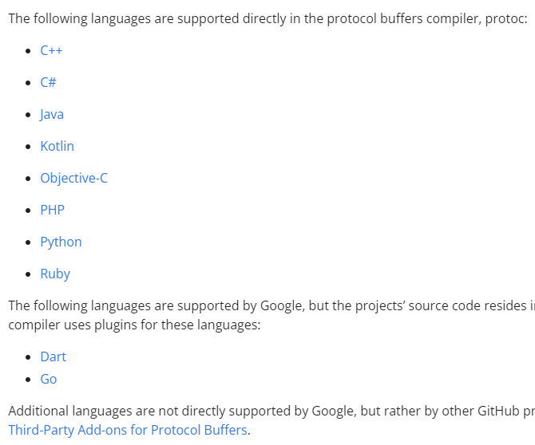
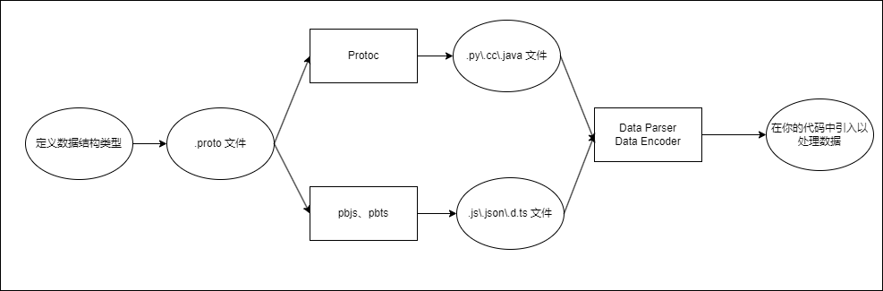

# ProtoBuf

ProtoBuf 是个好东西，是一款非常好用的 `数据序列化机制`，我在之前的工作中经常会用，而且随着使用场景的增加，愈发的深入了解、深入使用，我对 ProtoBuf 的喜爱程度只增不减。

在我的心目中，ProtoBuf 甚至要比 Json 更好用。所以这次就给大家介绍一下 ProtoBuf，结合我过往两年半的应用经验，来分析一下它为什么是个好东西。

## 概念介绍

### 简单介绍

```txt
Protocol Buffers - Google's data interchange format
```

鲁迅说过，“字越少，事越大” ，但不要慌，我给大家翻译一下啥意思。

“Google” 意思是 “牛逼”，“data interchange” = “数据交换”，“format” = "格式"，所以：

```txt
ProtoBuf 全称 Protocol Buffers，牛逼的数据交换格式。
```

### 详细说明

适度玩梗，接下来进入正题。

ProtoBuf 是一个跨语言、跨平台、可扩展的结构化数据的序列化机制。就像 XML，但却更小、更快、更简单。

```txt
You define how you want your data to be structured once, then you can use special generated source code to easily write and read your structured data to and from a variety of data streams and using a variety of languages.
```

**翻译**：

你只需要定义一遍你的数据的结构化格式，然后你就可以将其编译成某种特殊的代码，这种代码可以被各种语言引用，利用编译出来的代码，你就可以在各种语言中，实现对各种数据流的读写。

**说明**：

1. **数据结构化格式**： 其实就是 .proto 文件，像 TS 的 interface、C++ 和 Python 的 struct、Java 和 Node 的 entity）

2. **编译成特殊代码**：利用 protoc 编译工具，将 pb 文件编译成各种语言，举例：

    1. C++：编译成 .pb.h 和 .pb.cc 文件

    2. Python：编译成 xxx_pb.py 文件

    3. 其它支持的语言：

       

    4. Js：js 的编译工具叫 pbjs，是独立于 protoc 的存在，可以把 pb 编译成 js 或者 json，js 又分 commonjs 或者 es。但总之，就是编译成能被 js 程序引用的格式

3. **各种数据流的读写**：protobuf 可以实现各种数据格式之间的转换，比如 xml、json、pb binary、txt 等格式的转换、读写，并且还提供了一些比如 create、verify、encode、decode 等 API。

### Proto2 Proto3

我们上官网看，会发现有两个版本，两个版本其实区别并不太大，3 主要是增加了一些语言的支持，改了一些约定。我之前一直用的 2，感觉也挺好用的，不过初次使用当然是推荐 3 了。

1. proto3 更重约定而弱语法。比如：
    1. 移除了 default 标记，2 的时候是可以指定标记 [default=XX]，3 去掉了这个东西，3 中所有默认值都由系统决定默认值，也就是约定好的。避免序列端和反序列端设置的 default 不一致
    
    2. 枚举第一个 value 一定是 0
    3. 移除了 required, 2 是分 optional 和 required，但其实 required 一直都是不推荐使用的。
2. 增加了多种语言支持，Go、Ruby 等
3. 支持 map，proto2 是不支持的，都是用 Message 嵌套实现，现在支持 map 会更方便
4. 支持 json 映射，其实 pbjs 从 proto2 早就支持 json 的序列化了，我们前端开发并不需要太在意，只是其他语言如果想用 json 的话，就得用 proto3

## 上手使用

我这里并不会给大家讲 proto 语法、API 什么的，因为我讲的肯定不全，也不一定对。我就讲一些偏工程化的方案啥的。

也建议别去找知乎、掘金啥的文章看，简单看了一圈无非就是把官网上的东西拿过来简单翻译一遍，望大家多去官网上看，都写得非常全。

**通用工作流**：



**结合 monorepo**：


### 第一步，编写 .proto

我这里就写一个超简单的例子：

```proto
syntax = 'proto3'

package 'bilibili'

Message Bilibili {
    optional string department;

    optional message Bussiness {

    };

    optional int32 num;
}
```

### pbjs

前面说到需要有编译工具，才能将 .proto 编译成其他语言。对于大多数语言，都是用 protoc 进行编译，而 js 不一样，js 需要用到 pbjs 的库。它全程叫 protobuf.js , 使用起来也非常方便


## 应用

### 存储

#### every thing convert

#### 

### 通信

### 业务

### 配置

### 抽象

## 参考链接

[protobuf](https://protobuf.dev/)

[protobufjs]()