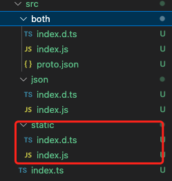

# ProtoBuf

ProtoBuf 是个好东西，是一款非常好用的 `数据序列化机制`，我在之前的工作中经常会用，而且随着使用场景的增加，愈发的深入了解、深入使用，我对 ProtoBuf 的喜爱程度只增不减。

在我的心目中，ProtoBuf 甚至要比 Json 更好用。所以这次就给大家介绍一下 ProtoBuf，结合我过往两年半的应用经验，来分析一下它为什么是个好东西。

## 概念介绍

### 简单介绍

```txt
Protocol Buffers - Google's data interchange format
```

鲁迅说过，“字越少，事越大” ，但不要慌，我给大家翻译一下啥意思。

“Google” 意思是 “牛逼”，“data interchange” = “数据交换”，“format” = "格式"，所以：

```txt
ProtoBuf 全称 Protocol Buffers，牛逼的数据交换格式。
```

### 详细说明

适度玩梗，接下来进入正题。

ProtoBuf 是一个跨语言、跨平台、可扩展的结构化数据的序列化机制。就像 XML，但却更小、更快、更简单。

```txt
You define how you want your data to be structured once, then you can use special generated source code to easily write and read your structured data to and from a variety of data streams and using a variety of languages.
```

**翻译**：

你只需要定义一遍你的数据的结构化格式，然后你就可以将其编译成某种特殊的代码，这种代码可以被各种语言引用，利用编译出来的代码，你就可以在各种语言中，实现对各种数据流的读写。

**说明**：

1. **数据结构化格式**： 其实就是 .proto 文件，像 TS 的 interface、C++ 和 Python 的 struct、Java 和 Node 的 entity）

2. **编译成特殊代码**：利用 protoc 编译工具，将 pb 文件编译成各种语言，举例：

   1. C++：编译成 .pb.h 和 .pb.cc 文件

   2. Python：编译成 xxx_pb.py 文件

   3. 其它支持的语言：

      

   4. Js：js 的编译工具叫 pbjs，是独立于 protoc 的存在，可以把 pb 编译成 js 或者 json，js 又分 commonjs 或者 es。但总之，就是编译成能被 js 程序引用的格式

3. **各种数据流的读写**：protobuf 可以实现各种数据格式之间的转换，比如 xml、json、pb binary、txt 等格式的转换、读写，并且还提供了一些比如 create、verify、encode、decode 等 API。

### `Proto2 Proto3`

我们上官网看，会发现有两个版本，两个版本其实区别并不太大，3 主要是增加了一些语言的支持，改了一些约定。我之前一直用的 2，感觉也挺好用的，不过初次使用当然是推荐 3 了。

1. proto3 更重约定而弱语法。比如：
   1. 移除了 default 标记，2 的时候是可以指定标记 [default=XX]，3 去掉了这个东西，3 中所有默认值都由系统决定默认值，也就是约定好的。避免序列端和反序列端设置的 default 不一致
      
   2. 枚举第一个 value 一定是 0
   3. 移除了 required, 2 是分 optional 和 required，但其实 required 一直都是不推荐使用的。
2. 增加了多种语言支持，Go、Ruby 等
3. 支持 map，proto2 是不支持的，都是用 Message 嵌套实现，现在支持 map 会更方便
4. 支持 json 映射，其实 pbjs 从 proto2 早就支持 json 的序列化了，我们前端开发并不需要太在意，只是其他语言如果想用 json 的话，就得用 proto3

## 上手使用

**通用工作流**：


**结合 monorepo**：


### 第一步，编写 .proto

我这里就写一个超简单的例子：

```proto
syntax = "proto3";

package bilibili;

message PointCloud {
  repeated Point points = 1;
  int32 size = 2;
}

message Point {
  int32 x = 1;
  int32 y = 2;
  int32 z = 3;
}
```

不难看出就是定义了一个点云数据结构。

### 第二步，编译

前面说到需要有编译工具，才能将 .proto 编译成其他语言。对于大多数语言，都是用 protoc 进行编译，而 js 不太一样。

这里需要说明的是，想要在项目中引用 proto，有两种方式：

1. 一种是借助 protobufjs 库，直接在 js 代码中 load proto 文件；
2. 一种是借助 protobufjs-cli，先将 proto 编译成 es6，再在 js 中引入【重点】

**`protobufjs`**：

protobufjs 是纯 js 实现，它支持 typescript。它的特点就是小并且速度快。

这里借用一张官网的图：


它的用法也比较简单，API 少但够用。这张图差不多把 protobufjs 的功能以及使用方式全都包括了。一个官网的例子基本就能介绍完：

```ts
import { load } from 'protobufjs' // respectively "./node_modules/protobufjs"

load('points.proto', function (err, root) {
  if (err) throw err

  // 获取数据类
  var PointCloud = root.lookupType('bilibili.PointCloud')

  // 声明一个字面量对象
  var payload = {
    points: [
      { x: 0, y: 0, z: 0 },
      { x: 1, y: 1, z: 1 },
    ],
    size: 10,
  }

  // 校验 payload 的准确性
  var errMsg = PointCloud.verify(payload)
  if (errMsg) throw Error(errMsg)

  // 根据字面量参数创建 message 对象
  var message = PointCloud.create(payload) // or use .fromObject if conversion is necessary

  // 编译成 Uint8Array (browser) or Buffer (node) 格式
  var buffer = PointCloud.encode(message).finish()
  // 可以导出 binary 文件，或者在 worker 线程之间传递数据，速度更快

  // 从 Uint8Array (browser) or Buffer (node) 解码成数据类
  var message = PointCloud.decode(buffer)
  // 一个作用就是读取大型文件，文件 encode 成 binary 后，体积会变小很多

  // 转成字面量对象
  var object = PointCloud.toObject(message, {
    longs: String,
    enums: String,
    bytes: String,
    // see ConversionOptions
  })
})
```

除了这些功能外，还有 encodeDelimited、decodeDelimited、reflection、custom classes、grpc 等等，大家可以自行前往官网查看。

protobufjs 的 load 方式存在一些问题：

1. 它一次只能 load 一份 proto 文件，多个 proto 需要 load 很多次，虽然可以先编译成一个 json 文件然后再 load，但这其实是下一节要说的内容了。

2. load 是需要花时间的，我并不想要这多余的开销

3. 它需要绑定在项目 repo 中，不同项目不好实现复用 proto 定义

4. 没有人喜欢写 callback 函数，万一我在某个 callback 里又去 load 一下，会很痛苦，又要考虑异步问题，又要考虑 this 指向问题

**`protobufjs-cli`**：

protbufjs-cli 是 protobufjs 提供的命令行编译工具 ———— `pbjs` 和 `pbts`。它可以把 proto 先编译成静态的，再引入到项目中使用。

#### 安装 pbjs、pbts

```bash
yarn add protobufjs@~6.11.3
yarn add protobufjs-cli@~1.1.1
```

> 这里限制 major 版本为 6 的主要是因为官网有提示：
>
> > Note that this library's versioning scheme is not semver-compatible for historical reasons. For guaranteed backward compatibility, always depend on ~6.A.B instead of ^6.A.B (hence the --save-prefix above).

安装完了之后，能在 `node_modules/prorobufjs-cli/bin/` 目录下，看到 pbjs 和 pbts 两个文件


#### 编译脚本

编译工具特别简单，参数也不多。执行 `yarn pbjs` 命令行就会打印出 help 信息，也可以去看官方文档，当然，为了防止你看一半就跳走了，我把链接放在了文章末尾 (=\_=)。

简要参数说明：

- -t,--target 目标格式，一共有 json、json-module、static、static-module、proto2、proto3，大家可以自己尝试一下，大概就是 static 模式体积最小，但功能不全；json 模式体积大点，但功能全，比如 lookup、typed fields 是非常实用的功能。
- -w,--wrap 模块类型，就是我们熟悉的 es6、commonjs、amd 这些
- -r,--root 指定 root 节点的名称，当你项目 app 中引入了两个 proto 库，它们 root 同名，app 最终打包的时候，可能会出现互相两个 proto 库互相覆盖的问题，所以 root 参数是很有用的
- -o,--out 结果文件，注意一点，结果文件路径在前，原 proto 文件路径在后

先准备 build.sh，我在源码中提供了 json、static、both 三种脚本，分别对应三种结果，大家可以自行看源码，我这里以 static 为例子：

```bash
# build_static.sh
protos='proto/*.proto' # 所有 proto 文件的路径，如果你有多个分组，是支持空格拼接的
target='src/static' # 编译生成文件的目标目录，为什么叫 src 后面会说

rm -rf $target # 清除历史结果
mkdir $target

pbjs -t static-module -w es6 -r root -o $target/index.js $protos # 编译至 es6
pbts -o $target/index.d.ts $target/index.js # 生成 d.ts 文件
```

然后修改 package.json

```json
{
  "scripts": {
    "build": "bash build_static.sh"
  }
}
```

#### 编译结果

我们看一下生成的结果：



js 文件就不截图给大家看了，一个图截不全，大家可以看我的源码，简单看下 d.ts 文件：


非常标准的 ts 声明，层级关系也跟你 proto 中声明的关系一致，值得一提的是，生成的 ts 声明，是可以当作规范来看的，比如使用 null 而不是 undefined，所有 interface 都以 I 开头等等。

### 第三步，打包成 monorepo 库

编译之后，就是考虑怎么引入到项目中了。毫无疑问，打包成 npm 包就是最好的选择，用 rollup 或者 vite 这种打包工具打包，再结合 monorepo 的工作流，即可实现复用，还可以将整个 monorepo 的业务，通过数据类型定义来做一遍梳理整合。

#### 准备工作

我这里准备了一份 lerna monorepo，大家可以直接 clone 我的源码，因为是 demo，所以只弄了一些必要配置：vue、ts、ts、vite。结构如下：

```bash
.
├── docs
│   └── readme.md # 文档
├── lerna.json
├── package.json
├── packages
│   ├── form # 【WIP】基于 proto 开发的 schemaform 工具库
│   ├── playground # demo app
│   └── protos  # proto lib
│       └── configs  # 打包工具配置，只需要把 es6 再编译一下，把 d.ts 拷贝一下
│           ├── vite.config.json.ts
│           ├── vite.config.static.ts
│           └── vite.config.ts
│       ├── proto  # 存放所有 .proto 文件
│           ├── api.proto
│           ├── points.proto
│           └── bilibili.proto
│       ├── scripts # 前面有贴代码
│           ├── build_json.sh
│           ├── build_static.sh
│           └── build.sh
│       ├── src # bash build.sh 的目标目录，之所以放到 src 就是为了 vite 进一步打包做准备
│       ├── package.json # build script 会跟其他库有点不太一样

```

#### `Vite` 打包

我之前一直用的是 webpack 和 rollup，vite 是第一次接触，想着学习一下，但看到官网说 vite 是基于 rollup 开发的，那就好办了，直接 rollup 老一套配置安排上。

同 build 脚本一样，我的源码中也准备了三份 config 文件，分别将结果打包到 dist 的 static、json、both 目录下，这里以 static 为例子：

```js
// 省略了一些内容，完整版在源码里
import { defineConfig } from 'vite'
import dts from 'vite-plugin-dts'

export default defineConfig({
  plugins: [dts({ copyDtsFiles: true })], // 拷贝 d.ts 到 dist
  build: {
    lib: {
      name: 'protos', // cjs 和 iife 模式下，给目标文件命名
      entry: fileURLToPath(new URL('./src/static/index.js', import.meta.url)), // 入口
      formats: ['es', 'cjs', 'iife'], // 生成多种模块化版本供不同的程序引用
    },
    watch: {
      include: [resolve(__dirname, 'src')], // 监听变化并重新打包，不过这里光监听 src 是不够的，下面就会说
    },
    rollupOptions: {
      output: {
        dir: 'dist/static', // 目标目录
      },
    },
  },
})
```

#### 动态编译

`vite build` 可以 watch，但它 watch 的是 src，src 是通过 `bash build.sh` 生成的，我们真正需要 watch 的是 `proto/` 目录，并在每次监听变化之后执行 `bash build.sh & vite build`，我不太清楚 vite 是否支持 watch 之后执行自定义的命令，但我知道另一个东西: **`nodemon`**

```bash
yarn lerna add nodemon --dev --scope=@pb/protos
```

```json
// package.json
{
  "scripts": {
    "dev": "nodemon --watch proto/ -e proto --exec yarn build",
    "clean": "rm -rf src & rm -rf dist",
    "prepare": "bash scripts/build.sh",
    "build": "yarn prepare & vite build"
  }
}
```

执行 yarn dev，之后每次修改 proto 文件，就能触发自动编译和打包了。

### 第四步，在 monorepo 中使用

```bash
# link
yarn lerna add @pb/protos --scope=@pb/playground
```

之后就可以在 playground 中 import:

```ts
import root, { bilibili } from '@pb/protos'

const pointsCloud: bilibili.IPointCloud = bilibili.PointCloud.create({
  points: [],
  size: 10,
})
```

再之后就是自由发挥想象力使用了。

## 应用

protobuf 的应用非常多，我列几个：

1. 通信，可以定义网络请求、grpc、线程通信，先压缩再通信
2. 数据，序列化，大数据压缩、分片，txt-pb-json-xml 各种格式转换
3. 结构，“数据结构” 可以做的事情太多了，定义配置、架构抽象、业务梳理等等

### 应用一： 文件读写，数据压缩

我在 playground 中写了个实例，大概功能是随机创建一百万个 points 的点云数据，然后分别导出和导入 json、bin 格式的文件：


#### 代码

```ts
// 导出
const exportFile = (type: 'json' | 'pb') => {
  const data: bilibili.IPointCloud = generateData() // 随机生成点云

  const a = document.createElement('a') // a 标签下载

  let url = ''
  let result = ''

  if (type === 'pb') {
    // encode
    const start = performance.now()
    const encodedData = bilibili.PointCloud.encode(data).finish() // 利用 protobuf 编译成 unit8Array, 关于 TypedArray 大家自行查阅吧. 需要知道的是 unit8Array\ArrayBuffer\Blob 是可以相互转换的
    console.log('[cost encode]: pb,', (performance.now() - start) / 1000)

    const blob = new Blob([encodedData], { type: 'application/octet-stream' }) // unit8Array 转至 Blob

    url = URL.createObjectURL(blob)
    result = 'pointcloud.pb'
  } else {
    const start = performance.now()
    const jsonData = bilibili.PointCloud.fromObject(data).toJSON() // 转换成 json 数据，看似有些多余，实则是为了测性能才这么写的。
    console.log('[cost encode]: json,', (performance.now() - start) / 1000)

    url = `data:text/plain, ${JSON.stringify(jsonData)}`
    result = 'pointcloud.json'
  }

  a.href = url
  a.download = result
  a.click()
  URL.revokeObjectURL(url)
}

// 导入
const uploadFile = (file: File) => {
  const reader = new FileReader()
  const start = performance.now()

  reader.onload = (event: any) => {
    const row = event.target.result

    if (typeof row === 'string') {
      const data = bilibili.PointCloud.fromObject(JSON.parse(row)) // 解析 json string
      console.log('[cost decode]:  json ,', (performance.now() - start) / 1000)
    } else {
      const unitArray = new Uint8Array(row) // ArrayBuffer 转 unit8Array
      const data = bilibili.PointCloud.decode(unitArray) // decode 成 js 对象
      console.log('[cost decode]:  pb ,', (performance.now() - start) / 1000)
    }
  }
  if (file.name.includes('json')) {
    reader.readAsText(file)
  } else {
    reader.readAsArrayBuffer(file) // 二进制文件读取，读出来之后是 ArrayBuffer 格式
  }
}
```

#### 时间统计


分析一下：

1. pb 的 encode 耗时比 json 更久，大概慢 2-4 倍，json 就是转一下字符串就行了，更快也不奇怪
2. pb 的 decode 耗时比 json 更少，大概快 2-3 倍，json parse 的速度居然还挺慢的
3. 把 encode、decode 时间加在一起，似乎没什么区别

> 注：我测试的时候发现了一个非常奇怪的问题，就是假如我把点云数据交给 vue ref 托管，测试出来速度慢的离谱，而且看越来越慢，看起来似乎有内存溢出的迹象，看下图：


如果觉得好奇，想自己测试一下，可以看我的源码，我都放在了代码里。

我控制变量测下来，感觉就是 ref 的问题。对于大型数据，最好不要交给 ref 托管，会影响性能。这也算是多了一个 `性能优化` 的手段。

#### 文件大小


考虑到耗时情况大致相同的前提下，可以看到 pb 差不多减少了 3 倍的空间。其实不光是文件，我们在网络请求中，或者任何形式的通信中，也可以考虑把大型数据先转成 pb 格式再进行传输，能减少带宽占用，加快传输速度。这又是一个 `性能优化` 点。

### 应用二：网络请求

protoubuf 一大优势就是跨语言，这意味着前端后端都可以用。所以，双方在实际写代码之前，可以先一起维护一份关于接口的 proto 定义，然后再按照 proto 约定，进行开发。除此之外，因为是跨语言的，哪天接入了一个 Python 后端、Go 后端、Node 后端，都可以沿用 proto 约定。


最重要的一点是它数据小，比 json 要小 3 倍多，特别是对于大数据传输，对于性能优化是很不错的手段。

#### 定义接口

```proto
message Request {
  int32 page = 1;
  int32 size = 2;
}

message TableData {
  string id = 1;
}

message Response {
  repeated TableData data = 1;
  int32 status = 2;
}
```

#### 前端请求

```ts
// 统一处理，将数据进行压缩，传递 arraybuffer

const httpService = axios.create({
  baseURL: 'http://localhost:3001', // 测试用后端地址
  timeout: 10000, // 我们内网 nginx 的超时设置就是 10s
  method: 'post',
  headers: {
    'X-Requested-With': 'XMLHttpRequest',
    'Content-Type': 'application/octet-stream', // 我们传输的是 proto encode 过的二进制数据
  },
  responseType: 'arraybuffer', // 接受到的也是后端用 proto encode 过的二进制数据
})

function request<T>(
  params: T,
  reqClazz: { encode: (message: T) => Writer },
  resClazz: { decode(v: Uint8Array): any } // 用 any 投个懒
) {
  return httpService
    .post('api', params, {
      transformRequest: (v) => {
        // encode 请求
        const ab = reqClazz.encode({ ...v }).finish()
        return ab
      },
      transformResponse: (v) => {
        // decode 返回
        const buf = new Uint8Array(v)
        return resClazz.decode(buf)
      },
    })
    .then
    // 处理请求
    ()
}
export { request }
```

```ts
// 使用
const params: bilibili.IRequest = {
  page: 1,
  size: 15,
}
request(params, bilibili.Request, bilibili.Response)
```

#### 后端接口

我用 express 简单搭了个后端，上代码：

```ts
// any 是偷懒行为，大家不要学
router.post('/api', (req: any, res: any) => {
  let bufferHelper = new BufferHelper()
  req.on('data', function (chunk: any) {
    // 接受二进制数据
    bufferHelper.concat(chunk)
  })
  req.on('end', function () {
    // 二进制数据接收完
    let buffer = bufferHelper.toBuffer();

    console.log(buffer) // 这里已经就是二进制文件了
    
    const parsedReq = bilibili.Request.decode(buffer)
    console.log('encode', parsedReq)
    // 测试一下返回  
    const encodedRes = bilibili.Response.encode({
      data: [{ id: 'test' }],
      status: 111111,
    }).finish()
    // 修改 header 
    res.set('Content-Type', 'application/octet-stream')
    res.send(encodedRes)
  })
})
```

#### 看看效果

playground 例子：


发起请求：


后端接受到请求数据：


前端接受后端返回：


### 应用三： `grpc`

### 应用四： `ProtoTxtFormat`

### 应用五： `ProtoForm`

## 结语

## 参考链接

[文章源码](https://github.com/OutisJie/protobuf)

[protobuf](https://protobuf.dev/)

[protobufjs](https://protobufjs.github.io/protobuf.js/index.html)

[protobufjs-cli](https://github.com/protobufjs/protobuf.js/blob/master/cli/README.md)
